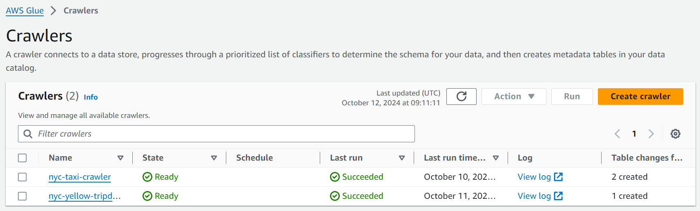

# AWS Data Lake Pipeline - Mimmit Koodaa Jumpstart Workshop

In this workshop, I built an end-to-end serverless data pipeline using AWS services as part of the *Mimmit Koodaa - Data Lake Jumpstart* workshop.

## Project Overview

This project demonstrates how to use various AWS services to create a scalable, serverless data lake architecture.

## AWS Services Used:

- **Amazon S3:** Central storage for raw and processed data.
- **AWS Glue:** Managed ETL service for data transformation and metadata management.
- **Amazon Athena:** Serverless query service for analyzing data with SQL.
- **Amazon QuickSight:** Business intelligence service for data visualization.

## Lab 1 – Discovering and Cataloging Your Data

### Overview
In this lab, I used AWS Glue to create a Glue Crawler that automatically discovers the schema of data stored in Amazon S3. The crawler registered the discovered information in the AWS Glue Data Catalog, allowing AWS Glue and other AWS services like Amazon Athena to query and process the data stored in S3.

